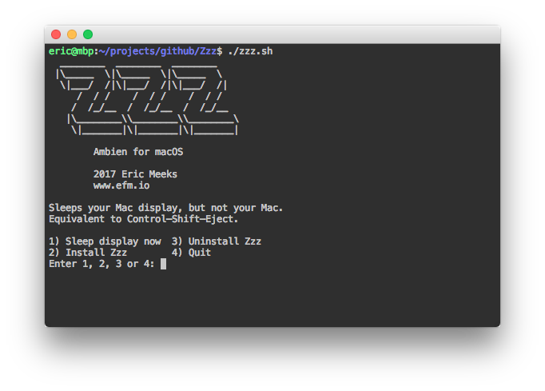

# Zzz

Here's command line tool I made to blank your Mac display without putting the machine to sleep.

It is the command line equivalent of <a href="https://support.apple.com/en-us/HT201236" target="new">Control–Shift–Eject</a>.

*Note: This only works on OS X*

> #### Why not just press ⌃⇧⏏ ?
>
> If you can physically press the keys, then by all means do that. However, Zzz is intended for applications where the user is not within reach of the physical machine e.g. remote ssh.

## Usage

```
# Download Zzz.zip
wget https://github.com/efmeeks/Zzz/archive/master.zip

# Unzip the archive
unzip Zzz-master.zip

# Open the folder
cd Zzz-master

# Ensure executability
chmod +x zzz.sh

Run the script
./zzz.sh
```

You should see something like this...

